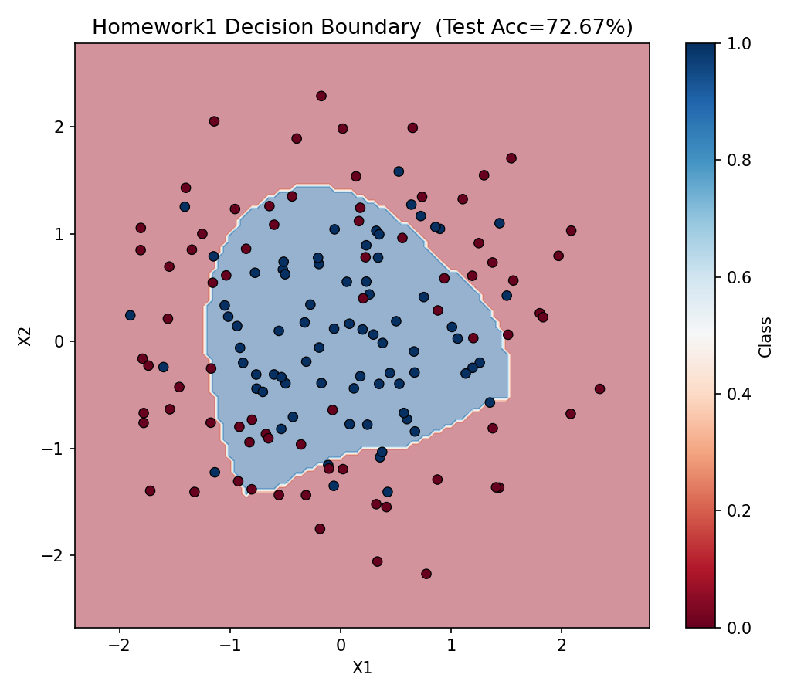
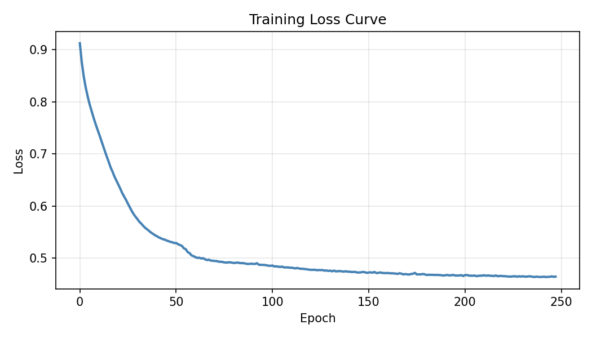
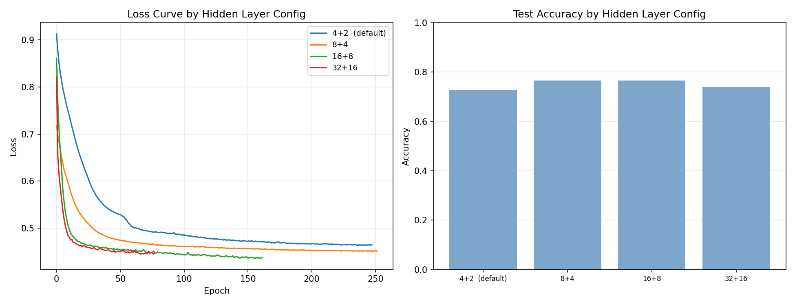

# 🧠 Deep Learning Homework Portfolio

作業涵蓋神經網路基礎、CNN 調參實驗與 FC/Dropout 正則化分析，使用工具包含 scikit-learn、PyTorch、CIFAR-10 資料集。

---

## 📁 目錄結構

```
deep-learning-homework/
├── README.md
├── hw1_neural_network_playground/
│   ├── Homework1_Playground.py
│   ├── hw1_decision_boundary.png
│   ├── hw1_loss_curve.png
│   └── hw1_hidden_layer_experiment.png
├── hw2_alexnet_tuning/
│   └── Homework2_AlexNet調參.py
└── hw3_fc_dropout_tuning/
    └── Homework3_FC與Dropout調參.py
```

---

## HW1 — Neural Network Playground（MLP 分類實驗）

模擬 Google Neural Network Playground，使用 scikit-learn MLPClassifier 對 `make_circles` 資料集進行二元分類。

**技術細節**
- 資料集：`make_circles`（500 筆，noise=0.3）
- 特徵工程：加入 X₁², X₂², X₁·X₂, sin(X₁), sin(X₂) 五個非線性特徵
- 模型架構：2 隱藏層（4+2 neurons），activation=ReLU，optimizer=Adam
- 實驗：比較 4+2 / 8+4 / 16+8 / 32+16 四種隱藏層配置

**結果**

| 配置 | Test Accuracy |
|------|:---:|
| 4+2（預設） | ~72.7% |
| 8+4 | ~77% |
| 16+8 | ~77% |
| 32+16 | ~70% |

**決策邊界（Test Acc = 72.67%）**



**訓練 Loss 曲線**



**隱藏層配置比較**



---

## HW2 — AlexNet 調參實驗（CIFAR-10）

基於 CIFAR-10（32×32 RGB，10 類）設計簡化版 AlexNet，逐一調整超參數並觀察 Loss 與 Accuracy 變化。

**技術細節**
- 框架：PyTorch + TensorBoard
- 資料集：CIFAR-10（50,000 train / 10,000 test）
- 架構：2 層 Conv → MaxPool → FC → Dropout → 輸出層

**四組實驗（one-at-a-time）**

| 實驗 | 固定參數 | 調整範圍 |
|------|---------|---------|
| A — 學習率 | channels=6 | lr ∈ {0.1, 0.01, 0.001} |
| B — 通道數 | lr=0.001 | channels ∈ {6, 16, 32} |
| C — FC 大小 | lr=0.001, ch=16 | FC ∈ {128, 256, 512} |
| D — Dropout | lr=0.001, ch=16, FC=512 | dropout ∈ {0.3, 0.5, 0.7} |

**執行方式**
```bash
pip install torch torchvision tensorboard matplotlib
python Homework2_AlexNet調參.py
tensorboard --logdir=runs
```

---

## HW3 — FC 大小與 Dropout 調參（過擬合分析）

在固定 Conv 特徵提取器（3 層 Conv，輸出 256×5×5 = 6400 維）的前提下，比較不同 FC 架構與 Dropout 率對泛化能力的影響。

**技術細節**
- 特徵提取器：Conv(3→64→128→256) + AdaptiveAvgPool2d(5×5)，權重固定
- FC 架構三種：Small（512）/ Medium（1024→256）/ Large（2048→1024）
- 過擬合診斷：Train Acc − Test Acc > 0.1 視為警示

**兩組實驗**

| 實驗 | 固定參數 | 調整範圍 |
|------|---------|---------|
| A — FC 大小 | dropout=0.5 | Small / Medium / Large |
| B — Dropout 率 | FC=Small | dropout ∈ {0.0, 0.3, 0.5} |

**執行方式**
```bash
python Homework3_FC與Dropout調參.py
tensorboard --logdir=runs
```

---

## 環境需求

```bash
pip install scikit-learn matplotlib numpy torch torchvision tensorboard
```

- Python 3.10+
- CUDA（選用，CPU 亦可執行）

---

## 作者

學號：142216015  
課程：深度學習 / Big Data 應用
